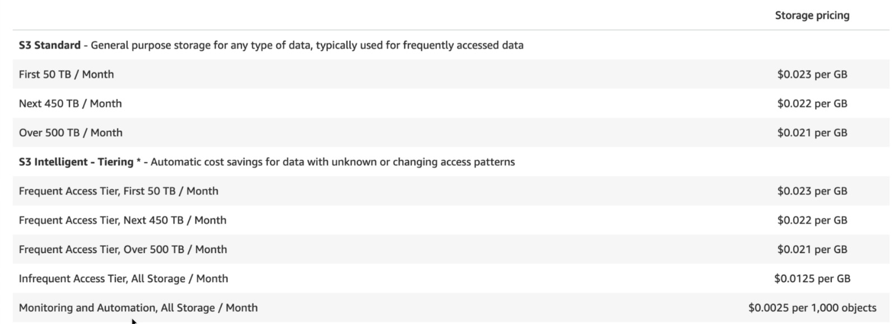
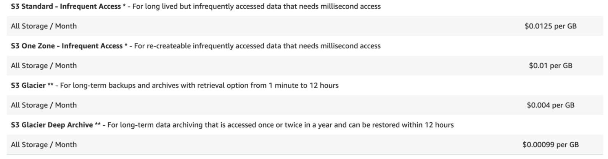

# Section 3 - Identitiy Access Management
## What is IAM?
Allows you to manage users and their level of access to the AWS console.

Offers:
* Centralized control of AWS account
* Shared access
* Granular permissions
* Identitiy federation (allows users to login with other third-party credentials)
* Multifactor authentication
* Provide temporary access for users/devices
* Allows you to set up a password rotation policy
* Supports PCI DSS compliance

## Key Terminology
**Users** - End users, such as people

**Groups** - A collection of users. Each user in the group will inherit the permissions of the group.

**Policies** - Made up of documents called Policy documents. These are in JSON and give permissions as to what a User/Group/Role is able to do.

**Roles** - You create roles and then assign them to AWS Resources to interact with other resources.

## What we learned from the IAM Lab
IAM is universal - it does not apply to specific regions.

The "root account" is simply the account created when the AWS account is first set up. It has complete Admin Access.

New users have no permissions when first created. 
* An assigned Access Key ID and Secret Access Key are used for programmatic access.
* These values are only viewable once and can not be regenerated.

Access Key ID and Secret Access Key can not be used to sign into the AWS Console.

Always set up Multifactor Authentification on your root account.

Can create your own custom password policies.

## Creating a Billing Alarm Lab

Set alarm to give notifications in the event that AWS account goes over some USD limit.

Use CloudWatch to create a Billing Alarm.
* Uses an SNS topic, which is a way to send an email.

---

## S3 101
Simple Storage Device

So what is it?
* A safe place to store your files
* Object-based storage
* Data is spread accross multiple devices and facilities.

Files can be 0 to 5 TB in size.

There is unlimited storage. Files are stored in Buckets.

Universal namespace, so bucket names must be unique globally. Used in web address, i.e.
`https://bucketname.s3.amazonaws.com`

When uploading to S3, you will receive a HTTP 200 status code sent to browser.

## S3 - Objects
S3 is object-based, where each file is an object that consists of:
* Key (The name of the object)
* Value - data
* Version ID
* Metadata
* Subresources (Access control lists, Torrent)

## Data Consistency Model for S3
How does it keep data consistent?
* Read after Write consistency for PUTS of new Objects
* Eventual Consistency for overwrite PUTS and DELETES

## S3 - Guarantees
Built for 99.99% availability

Amazon guarantees 99.9% availability

Amazon guarantees 99.999999999% durability for S3 information (11 x 9's)

## S3 - Features
* Tiered storage available
* Lifecycle Management
* Versioning
* Encryption
* MFA Delete
* Secure your data using Access Controls Lists and Buclet Policies

## S3 - Storage Classes
1. S3 Standard 
    * 99.99% availability
    * 99.999999999& durability
    * Stored redundantly across multiple devices in multiple facilities
    * Desgined to sustain loss of 2 facilities concurrently.
2. S3 - IA (Infrequently Accessed)
    * Accessed less frequently, but rapidly when needed.
    * Lower fee than S3 Standard, but includes a retrieval fee
3. S3 One Zone - IA
    * Lower cost for infrequently used data
    * Does not have multiple Availability Zone resistance
4. S3 - Intelligent Testing
    * Moves data to most cost-effective access tier
5. S3 Glacier
    * Secure, durable, low-cost storage for data archiving
    * Retrieval time configurable from minutes to hours
6. S3 Glacier Deep Archive
    * Lowest-cost storage class
    * Retrieval time of up to 12 hours is acceptable

First byte latency is milliseconds for each class, except for S3 Glacier which is based on retrieval time configurations.

## S3 - Charges
You are charged in the following ways:
* Storage
* Requests
* Storage Management Pricing
* Data Transfer Pricing
* Transfer Acceleration 
* Cross Region Replication Pricing  

**Cross Region Replication** - Anytime a bucket is updated, cross-region buckets are updated as well.

**Transfer Acceleration** - Enables end users to interact with buckets more faster by using CloudFront's edge location.

## S3 - Exam Tips
S3 is object-based, i.e. allows you to upload files as objects.

Files can be from 0 to 5 TB, stored in buckets.

There is unlimited storage.

S3 is a universal namespace. That is, each bucket name must be uniqie.

`https://acloudguru.s3.amazonaws.com/` uses default location East Virginia.

`https://acloudguru.eu-west-1.amazonaws.com/` uses a non-default location.

Not suitable for storing an OS or Database

Successful uploads will generate a HTTP 200 status code

You can turn on MFA Delete

The key fundamentals of S3 are:
* Key
* Value
* Version ID
* Metadata
* Subresources (Access Control Lists, Torrent)

Consistency Model:
* Read after write consistency for PUTS of new objects.
* Eventual consistency (can take time to propagate) for overwrite PUTS and DELETES

See different Storage Classes

Also, read S3 FAQ prior to taking exam!

## S3 Bucket Lab - Exam Tips
Control access to buckets using either a bucket ACL or using Bucket Policies

Buckets are a universal name space and return HTTP 200 status code on successful upload.

---

## S3 - Pricing Tiers
What makes up the cost of S3?
* Storage (by the GB)
* Requests and Data Retrievals
* Data Transfer
* Management and Replication

Looking at Storage Pricing:
* S3 Intelligent Tiering offers at most same cost of S3 Standard, while potentially offering IA pricing
* S3 Intelligent however does have a Monitoring and Automation fee of $0.0025/mo per 1,000 objects

Other options are much cheaper, with elevated retrieval costs.

## S3 - Pricing: Exam Tips
Understand how to get the best value out of S3 based on some given scenario.
* Typically, try to go with Intelligent Tiering
* If not worried about redundancy, the IA - One Zone may be best

---

## S3 - Security & Encryption
By default, all newly created buckets are PRIVATE. You can set up access control to your buckets using;
* Bucket Policies
* Access Control Lists

S3 buckets can be configured to create access logs, which will log all requests made to that bucket. This can be sent to another bucket and even another bucket in another account.

## S3 Encryption - The Basics
**Encryption In Transit** is when your computer and the server's traffic is encrypted (Think https)

Encryption In Transit is achieved by
* SSL/TLS

**Encryption At Rest** is encrypting that data that is stored server side.

Encryption At Rest is achieved by:
* S3 Managed Keys - SSE-S3 (Service-side encryption)
    * Where Amazon encrypts and decrypts keys for you.
* AWS Key Management Service, Managed Keys - SSE-KMS
    * Where you and Amazon manage the keys together
* Service Side Encryption With Customer Provided Keys - SSE-C
    * Where you give your keys to Amazon that you manage

There may also be Client Side Encryption where you encrypy the object and then upload it to S3.

To add encryption to an S3 bucket, just go into the AWS Console and select S3. Then select your S3 bucket and on the right-hand side of screen, click encryption to select a type.
* Interesting to think about, what this does is mean that if someone were to break in to the AWS server and take a hard disk why my bucket stored on it, it would still be encrypted without the appropriate AWS encryption key.

---

## S3 Versioning - Basics
Stores all versions of an object (including all writes and even deletes if you delete an object).

Once versioning is enabled on a bucket, **Versioning cannot be disabled**, only suspended (you would have to delete the bucket and create a new one to completely turn it off).

Integrates with **Lifecycle** rules, which will be covered in the next lecture to explain how to move things to Glacier.

Versioning's **MFA Delete* capability uses multi-factor authentication, which can be used to provided an additional layer of security.

## S3 Versioning - Lab

After going into bucket, clicking 'properties' allows you to enable Versioning. (Can only enable or suspend)

Then after uploading file to the bucket, you can make said file public. Then, after cicking object URL, you can access this file in a browser.

We can then make an update to the file, and re-upload it to the bucket. After uploading the file, what do you think will happen to the permissions of this file? Will it still be public? Well, if we click on the object URL again we will learn that by uploading a new version of the file, the permissions will update, requiring you to make public again.

Within the bucket, once versioning has been turned on, there is a *Versions* UI area that appears within the S3 bucket overview. If click Show, you will see different version ID's and Size. 
* Note, the bucket's total size is the sum of sizes of each version
* Enabling a Lifecycle policy will retire old version quickly

If using Actions->Delete (when Version->Hide is selected) to remove a file, note it will appear to have been deleted. However if we select Versions->Show, we will see all previous versions, including a new version containing a delete marker. We can delete this delete marker to restore the most recent version.

## S3 Version Lab - Exam Tips
Versioning stores all versions of an object (including all writes and even if you delete an object).

Great backup tool.

Once enabled, Versioning cannot be disabled, only suspended.

Integrates with Lifecycle rules.

Versioning's MFA Delete capability, which uses multi-factor authentication, can be used to provide an additional layer of security.

## S3 Lifecycle Management with S3 - Lab
Can go into a bucket and into 'Management', where we can add a 'lifecycle rule' to manage an object's lifecycle.

Lifecycle rules:
* Enable you to transition objects to the Standard - IA and/or the Amazon Glacier Storage class.
* Can automatically expire objects based on your retention needs.

Click on 'Add lifecycle rule', name it, and select 'Storage class transition'.
* This allows you to enable lifecycle rules on an object's current version, previous versions, or both.
* Can make transitions on curren version such as 'Transition to Standard-IA after 30 days' and 'Transition to Amazon Glacier after 60 days' 
* On previous versions may use something exactly the same.

Next, you can configure expiration:
* For both current and previous versions, may select something like 'Expire current version of object after 425 days from object creation' and 'Permanently delete previous versions after 425 days from begining of previous version'
* Can also clean up incomplete multipart uploads.

Finally, there is the Review page where we can verify Name, Scope, Transitions and Expirations of objects within the bucket.

## S3 Lifecycle Management - Exam Tips
Lifecycle management enables to you to automate moving your objects between different storage tiers.

Can be used in conjunction with versioning (Differentiate lifecycle activity between current and older versions).

---

## AWS Organizations & Consolidated Billing

Can have cross acount access in S3 buckets. Only way to enable this is to turn on AWS Organizations.

What is it?

An account management service that enables you to consolidate multiple AWS accounts into an organization that you create and centrally manage.

Allows multiple AWS accounts to be centrally managed.

Can also do **consolidated billing**. The more storage you do, the less you pay. Therefore, allows you to aggregate all of your expenses.

Advantages of Consolidated Billing:
* One bill per AWS account
* Very easy to track charges and allocate costs
* Volume pricing discount

## AWS Organizations & Consolidated Billing - Exam Tips

Some Best Practices with AWS Organizations.
* Always enable MFA on root account.
* Always use a strong and complex password on the root account
* Paying account should be used for billing purposes only. Do not deploy resources into the paying account.
* Enable/Disable AWS services using Service Control Policies (SCP) either on Organizational Units (OU) or on individual accounts.
    * For instance if you don't want the finance department to spin up EC2 instances, you disable EC2 using SCP's.

## Sharing S3 Buckets Across Accounts

There are three different ways to share S3 buckets across accounts:
* Using Bucket Policies & IAM (applies across the entire bucket). Programmatic acccess only
* Using Bucket Access Control List's (ACL's) & IAM (applies tp individual  objects). Programmatic access only.
* Cross-account IAM Roles. Programmatic and Console access.

Roles will be covered later in course, however note it is a way of granting temporary access to an AWS resource, from another service or by another AWS account.

These can be created within IAM, which allow us to create a role for another AWS account by providing the account ID. Attaching policies to the role is what gives the role access to an AWS resource.

## Sharing S3 Buckets Across Accounts - Exam Tips

3 Different ways to share S3 buckets across accounts:
* Using Bucket Policies & IAM (applies across the entire bucket). Programmatic access only.
* Using Bucket ACL's & IAM (applies at the individual object level). Programmatic access only.
* Cross-account IAM Roles. Programmatic AND Console access.

## Cross Region Replication Lab

Need to go into bucket >> Management >> Replication and click add rule. Cross Region Replicatin requires versioning to be enabled on the bucket.

After clicking Add Rule, you can choose to replciate entire bucket OR prefix or tags.

Then set Destination Bucket, where you can choose a bucket in this account or another. Can also choose to create a new one, in which it will ask for you to select a name and region. 

May also change storage class and ownership for replicated bucket. 

Then under configuration options, you will have to select an IAM role, which wll automatically create a Role allowing for S3 Cross Region Replication. 

When we set up cross region replication, we will see it has the sinherited permissions as the bucket we replicated from but we can not see any objects in the bucket, and this is because when we set up cross region replication it is not going to transfer the items already in that bucket - these have to be uploaded manually.

If you create a delete marker in your original bucket, it will not be replicated in the replicated bucket.

## Cross Region Replication - Exam Tips
* Versioning must be enabled on both source and destination buckets.
* Files in an exisiting bucket are not replicated automatically.
* All subsequent updated files will be replicated automatically.
* Deleting individual versions or delete markers will not be replicated.
* Understand what Cross Region Replicatin is at a high level.

## Transfer Acceleration
What is S3 Transfer Acceleration?

It utilizes the CloudFront Network to accelerate your uploads to S3. 
* Instead of uploading directly to your S3 bucket, you can use a distinct URL to upload directly to an edge location which will then transfer that file to S3. You will get a distinct URL to upload to.

Amazon has built a tool to test that acceleration.

---

## CloudFront